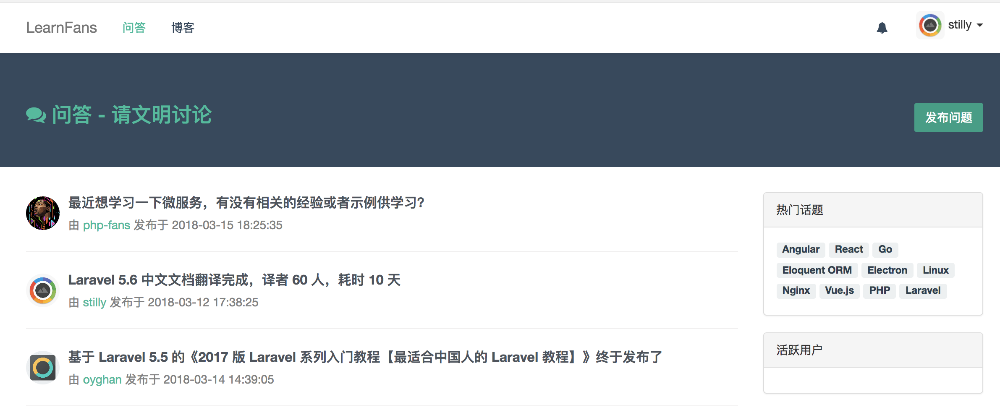

# laravel+vue问答社区
  该项目仅仅是用来练习laravel+vue开发模式。
  
### 已实现功能
  - [x] 前台
    - [x] 用户
      - [x] 注册，登录(基于make:auth的用户认证)
      - [x] 个人中心、个人资料设置，头像设置(vue组件化，上传到七牛云)、修改密码
      - [x] 发布问题、点赞，评论、答案、关注用户、发送私信(vue组件化开发)
    - [x] 前台页面
      - [x] 首页(最新问题、热门话题、活跃用户榜)
      - [x] 问题详情、评论组件


### 效果图


  

### 安装步骤
克隆项目代码
```
git clone https://github.com/oyghan/laravel-vue-forum.git
```

生成配置文件
```
cp .example.env .env
```

配置应用&数据库
```
APP_DEBUG=true

DB_DATABASE=homestead
DB_USERNAME=homestead
DB_PASSWORD=secret
```

安装Composer依赖
```
composer install
```

安装前端依赖
```
npm install || yarn
```

数据填充
```
migrate
```

Nginx配置
```
location / {
    try_files $uri $uri/ /index.php?$query_string;
}
```

有任何问题欢迎讨论。Enjoy~
